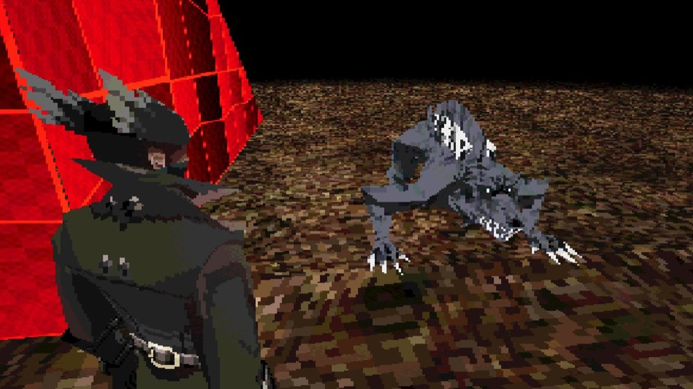
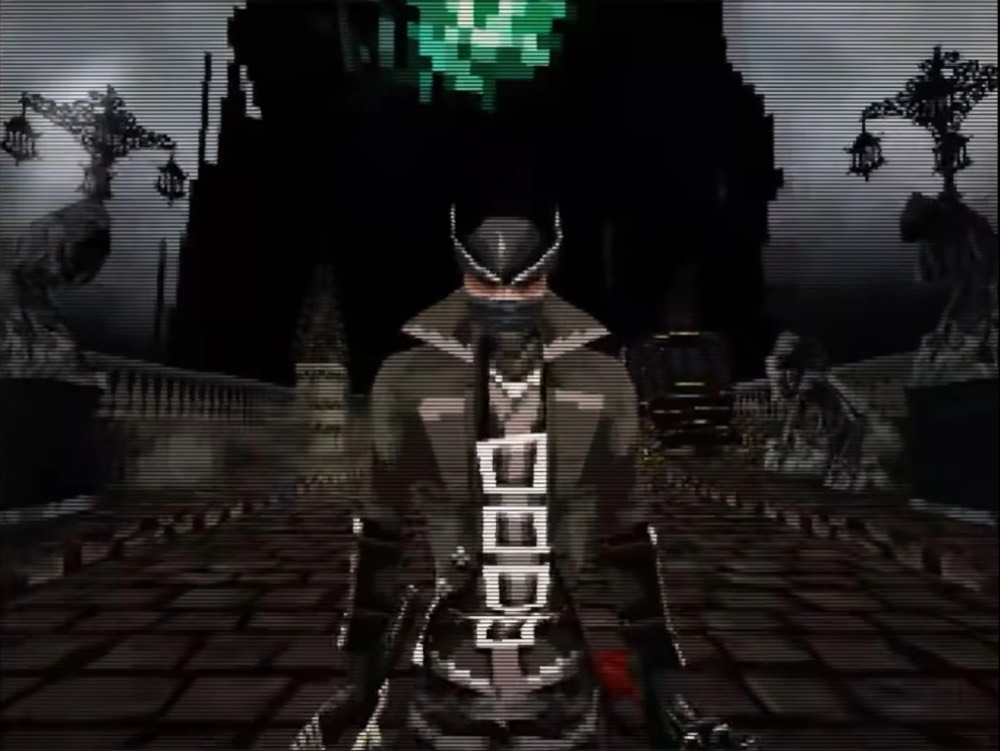
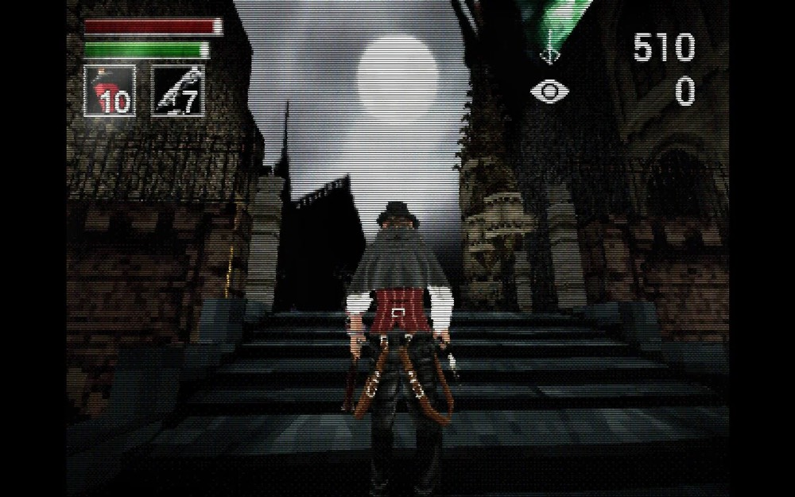
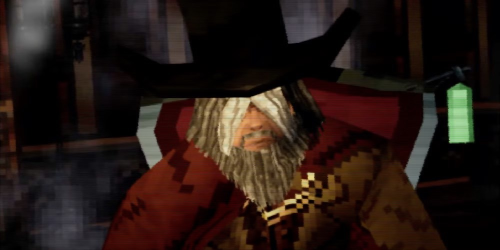

# The look: Bloodborne PSX demake, in R3F

Art direction for the arcade, set by Jono at T+0:15 (2026-09-26). Target: **a PS1-era demake**, the way [Bloodborne PSX](https://en.wikipedia.org/wiki/Bloodborne_PSX) (Lilith Walther, 2022) reads on a CRT: black void, gaslamp gloom, wobbling vertices, crunchy 15-bit dither, scanlines. The crunch is the point: it hides rough procedural geometry, so nobody needs Blender and nobody needs to polish edges.

Reference screenshots (the look target, not assets to copy): [`refs/`](./refs/)

| | |
|---|---|
|  |  |
|  |  |

What the four images agree on, in order of how much each does for us:

1. **Low internal resolution, nearest upscale.** Everything is chunky. This alone hides most primitive-geometry sins.
2. **Scanlines and a dark vignette at screen resolution**, over the chunky image (2, 3, 4). The two resolutions layered is the "CRT" read.
3. **Dithered, posterised colour.** Cloth, floors and glows band into 4×4 patterns (1, 2, 4). No smooth gradients anywhere.
4. **Black void and fog.** No skybox; things fade to black a few metres out (1, 2). The Room floats in nothing.
5. **Vertex lighting (Gouraud), no shadow maps.** Light pools per vertex; hard-edged low-seg meshes; one strong coloured light source (the green lamp in 2 and 4, the moon in 3).
6. **Vertex wobble and affine texture swim.** Subtle at rest, obvious when the camera moves (the fly-to will sell it).
7. **Tiny noisy textures with no filtering** (1's floor, 4's cloth). We have no texture assets; a 32×32 procedural canvas texture with `NearestFilter` gives the same crunch.
8. **Palette**: near-black, muddy brown, stone grey, blood red, sickly lamp green, bone white; blue-grey moonlight. Roboto blue survives as gaslamp blue; Gold stays gold; the Stacker's red boxes were already planned.

## Recipe (verified against the pinned stack, 2026-09-26)

Two layers. **GL layer** (the "PS1 GPU"): low-res canvas, Lambert materials with a vertex-snap patch, fog, one dither+posterise post effect. **DOM layer** (the "CRT glass"): a CSS overlay at native resolution with scanlines, vignette and corner glare. Splitting them keeps scanlines crisp while the picture underneath is chunky, and the DOM half costs nothing.

### 0. Packages

Add to the pins from [r3f-physics-recipe.md](./r3f-physics-recipe.md):

```json
"postprocessing": "6.39.5",
"@react-three/postprocessing": "3.1.2"
```

Checked on npm 2026-09-26: `postprocessing@6.39.5` peers `three >= 0.168.0 < 0.187.0` (our three is 0.186.1); `@react-three/postprocessing@3.1.2` peers `@react-three/fiber >=9.7.0`, `react ^19`, `postprocessing ^6.36.0`. Fits.

### 1. Low-res canvas (the 80% effect, two lines)

fiber's `dpr` passes a plain number straight to `setPixelRatio` with no clamp (only the `[min, max]` array form clamps: `calculateDpr` in fiber `core/utils.tsx`). So:

```tsx
<Canvas dpr={0.35} flat gl={{ antialias: false }} style={{ imageRendering: 'pixelated' }} ...>
```

- `dpr={0.35}` on a 1440-wide viewport renders ~500 px wide; the browser upscales the canvas element. `image-rendering: pixelated` makes that upscale nearest-neighbour instead of blurry. Roman Liutikov's PS1 write-up says true 320×240 is "too extreme" on modern aspect ratios and recommends dividing the viewport by 2 to 4; 0.35 is inside that band. Tune by eye; expose it as a constant.
- `antialias: false`: MSAA smooths the exact edges we want jagged.
- `flat` = `NoToneMapping`: ACES desaturates the palette and the posterise step wants raw colour.
- Shadows off (`shadows` prop omitted, no `castShadow` anywhere). PS1 had none, and shadow maps at 0.35 dpr look wrong anyway. Ground cabinets with `ContactShadows frames={1}` if they float, or a dark flat disc.
- Raycasting for "click a Machine" is unaffected: pointer events use CSS pixels.
- Every `src/app/dev/*` harness page mounts the same wrapper (`src/world/ArcadeCanvas.tsx`, issue 09) so each dev sees their Machine through the crunch from the start. The scaffold's `Room.tsx` currently holds the Canvas inline with Standard `flatShading` and shadow maps; issue 09 moves the Canvas out and drops both.

### 2. Materials: Lambert (Gouraud) + vertex snap patch

`meshLambertMaterial` without `flatShading` is per-vertex lighting: that is Gouraud, which is what the PS1 did. It is also the cheapest lit material. Keep the low-segment primitives from the physics recipe (`icosahedronGeometry args={[r, 0]}`, `cylinderGeometry args={[r, r, h, 8]}`) so facets stay visible under Gouraud.

Vertex snap goes in via `onBeforeCompile`, patching the `project_vertex` chunk (the Codrops R3F jitter tutorial and Liutikov use the same trick):

```ts
// src/world/look/psx-material.ts
import * as THREE from 'three'

export const SNAP = new THREE.Vector2(160, 120)   // NDC grid; lower = more wobble

export function psxify<M extends THREE.Material>(material: M, affine = false): M {
  material.onBeforeCompile = (shader) => {
    shader.uniforms.uSnap = { value: SNAP }
    // Snap after projection; mvPosition and gl_Position both exist at this point.
    shader.vertexShader = `uniform vec2 uSnap;\nvarying float vAffine;\n` + shader.vertexShader.replace(
      '#include <project_vertex>',
      `#include <project_vertex>
       gl_Position.xy = floor(gl_Position.xy / gl_Position.w * uSnap) / uSnap * gl_Position.w;
       vAffine = 1.0 + length(mvPosition.xyz) * 0.05;
       #ifdef USE_MAP
       vMapUv *= vAffine;
       #endif`,
    )
    if (affine) {
      // Affine texture swim: uv was scaled per vertex above; divide back per fragment.
      shader.fragmentShader = `varying float vAffine;\n` + shader.fragmentShader.replace(
        'vec4 sampledDiffuseColor = texture2D( map, vMapUv );',
        'vec4 sampledDiffuseColor = texture2D( map, vMapUv / vAffine );',
      )
    }
  }
  material.customProgramCacheKey = () => `psx${affine ? '-affine' : ''}`
  return material
}
```

- `customProgramCacheKey` is required: three caches compiled programs per material class, and without a distinct key a patched Lambert would share a program with an unpatched one.
- `vMapUv *= vAffine` runs only when `affine` is true for that material's use (it is guarded by `USE_MAP`, and `psxify(m, false)` on a plain-colour material leaves the fragment sampling alone, so the scaled uv is harmless there). In r186 the map chunk reads `vMapUv` and the sample line is `vec4 sampledDiffuseColor = texture2D( map, vMapUv );` (`three/src/renderers/shaders/ShaderChunk/map_fragment.glsl.js`); the affine replace targets that exact line. If a future three changes it the replace is a silent no-op, not a crash. Affine only matters on textured meshes; skip it on plain-colour ones.
- Wire it into the palette module: `palette.ts` exports one `psxify(new MeshLambertMaterial({ color }))` per colour, shared by every mesh (same rule as the physics recipe: one material instance per colour).
- Tune `SNAP`: 160×120 is a strong wobble; 320×240 is subtle. Bloodborne PSX is on the strong side.

### 3. Fog and the void

```tsx
<color attach="background" args={['#050406']} />
<fog attach="fog" args={['#050406', 6, 18]} />
```

Room mode sits at ~14 units, so the Room's far wall fades but is readable; in Play mode the fog is behind the cabinet. Fog and background must match or the horizon shows. Lambert supports fog by default.

Lighting for the mood: `hemisphereLight` dim and cold (`#3a4560` sky, `#1a1410` ground, intensity ~0.6), one warm/green `pointLight` per lamp prop (`#7ee2a0`, intensity 6, distance 6, decay 2), and a faint blue-grey `directionalLight` (~0.8) as moonlight so cabinet tops read. Intensities are physical since r155; start there and tune.

### 4. Dither + posterise (one custom effect)

Neither `Scanline` nor `Pixelation` from `@react-three/postprocessing` is needed (scanlines go in the DOM, pixelation is the dpr). Built-in `ColorDepth` posterises but does not dither, and the dither is what makes the banding look like PS1 rather than a broken monitor. One custom effect does both, ordered-dither then quantise to 32 levels per channel (15-bit, the PS1's framebuffer depth):

```tsx
// src/world/look/Dither.tsx
'use client'
import { forwardRef, useMemo } from 'react'
import { Effect, BlendFunction } from 'postprocessing'
import { Uniform } from 'three'

const frag = /* glsl */ `
uniform float levels;
const mat4 bayer = mat4(
   0.0,  8.0,  2.0, 10.0,
  12.0,  4.0, 14.0,  6.0,
   3.0, 11.0,  1.0,  9.0,
  15.0,  7.0, 13.0,  5.0) / 16.0;
void mainImage(const in vec4 inputColor, const in vec2 uv, out vec4 outputColor) {
  ivec2 p = ivec2(mod(uv * resolution, 4.0));
  float t = bayer[p.x][p.y] - 0.5;
  vec3 c = inputColor.rgb + t / levels;
  outputColor = vec4(floor(c * levels + 0.5) / levels, inputColor.a);
}`

class DitherEffect extends Effect {
  constructor(levels = 32) {
    super('Dither', frag, { blendFunction: BlendFunction.NORMAL, uniforms: new Map([['levels', new Uniform(levels)]]) })
  }
}

export const Dither = forwardRef<DitherEffect, { levels?: number }>(function Dither({ levels = 32 }, ref) {
  const effect = useMemo(() => new DitherEffect(levels), [levels])
  return <primitive ref={ref} object={effect} dispose={null} />
})
```

```tsx
// in the Canvas, after the scene
<EffectComposer multisampling={0}>
  <Dither levels={32} />
</EffectComposer>
```

- The `mainImage(const in vec4 inputColor, const in vec2 uv, out vec4 outputColor)` signature and the free `resolution` uniform are from the postprocessing wiki ("Custom Effects"). `resolution` is the render target size, which at `dpr 0.35` is the low-res buffer, so the 4×4 pattern lands on the chunky pixels, as on hardware.
- `multisampling={0}` on the composer; the default MSAA would undo the jaggies.
- `levels={32}` = 15-bit. Drop to 16 or 8 for a heavier crunch during the Gold shine or a Round-end moment.
- Optional extras from the same library, one line each, if the frame budget allows: `ChromaticAberration offset={[0.0015, 0.0015]}` for CRT colour fringing (image 2), `Noise opacity={0.08}` for grain. `Glitch` is the Round-end fail moment if someone has five minutes.

### 5. CRT glass: DOM overlay

A sibling of the canvas, native resolution, `pointer-events: none`, above the canvas and below the HUD:

```css
/* src/world/look/crt.css */
.crt {
  position: absolute; inset: 0; pointer-events: none;
  background:
    repeating-linear-gradient(to bottom, rgba(0,0,0,0) 0 2px, rgba(0,0,0,0.35) 2px 3px),          /* scanlines */
    radial-gradient(ellipse at 50% 45%, rgba(0,0,0,0) 55%, rgba(0,0,0,0.55) 100%);                 /* vignette */
}
.crt::after {                                                                                       /* corner glare, image 3 */
  content: ''; position: absolute; inset: 0;
  background: radial-gradient(ellipse at 18% 8%, rgba(255,255,255,0.10), rgba(255,255,255,0) 40%);
}
```

Scanline pitch 3px at native resolution reads like images 2 to 4. On a 2× display use 4px. Keep the HUD (Tailwind) above the overlay so it stays crisp; HUD text itself should be a pixel font at a fixed small size, no anti-aliasing tricks needed.

### 6. Crunchy textures without assets

For floors, walls and cloth: generate a `CanvasTexture` once, 32×32 or 64×64, base colour plus scattered darker pixels and a one-pixel grid line, `magFilter = NearestFilter`, `minFilter = NearestFilter`, `generateMipmaps = false`, `wrapS = wrapT = RepeatWrapping`, `repeat.set(w, h)` per surface. Twenty lines in `src/world/look/textures.ts`. Pair with `psxify(material, true)` so the texture swims. This is what makes image 1's floor and image 4's cloth; it is optional on cabinets, which read fine as flat Lambert colour.

### 7. Toggle

`?clean=1` on any page skips the overlay, the composer and the dpr drop (sets `dpr={[1, 1.5]}`), so a dev can check that a bug is theirs and not the look's. One boolean read once in the wrapper.

## 8. Atmosphere (added 2026-09-26, the "charisma" pass)

`src/world/look/Atmosphere.tsx`, mounted once from `RoomEnvironment`. Fake volumetrics the way the PS1 did them: additive geometry, no depth write, and the dither pass bands every gradient into steps.

- **`LightCone`**: open frustum under each ceiling tube, a hand-written `ShaderMaterial` (vertex snap inlined) that fades by height, by rim (`|n·v|`, so tangential faces go soft) and by distance to the camera (`smoothstep(1.5, 5.5)`), because the hub camera walks through these and an additive cone around the camera washes the whole frame. The tube over the hub camera gets a ceiling halo instead, for that reason.
- **`Glow`**: a soft plane, `band` for neon tubes (fades across its height), `spot` for screens, the marquee and fixtures. Optional `pulse` for the neon-transformer breathe.
- **`Dust`**: ~320 additive points drifting in place; positions mutate in the buffer, no allocation.
- **`BrokenTube`**: the middle fixture over the cabinets is steady, then every 45–120 s it stutters for a second or two (hash of `floor(t*16)`, fast attack, slow decay); one ref drives its point light, cone and ceiling panel. First episode 15–35 s after load.
- **Bloom** sits before `Dither` in `ArcadeCanvas` (`LOOK.bloom`): threshold 0.62 so only glow blocks, screens and the sign cross it, then the dither crunches the halo. Fog is now `[8, 33]` and the void is smoky `#171535` rather than near-black; the CSS vignette went up to 0.3 to keep the corners dark.

## Live values (recorded 2026-09-26, issue 12)

What `src/world/look/constants.ts` and `src/world/look/crt.css` ship, so the doc and the code agree. Issue 12 held these fixed: Display text on the cabinets has to read through them (ADR 0001).

| Setting | Live value | Where |
|---|---|---|
| dpr | 0.7 (`?clean=1`: [1, 1.5]) | `LOOK.dpr` |
| Void (background and fog colour) | `#171535`, indigo | `LOOK.void` |
| Fog | near 8, far 33 | `LOOK.fog` |
| Vertex snap grid | 160 x 120 | `LOOK.snap` |
| Dither levels | 32 per channel (15-bit) | `LOOK.ditherLevels` |
| Bloom (before the dither) | threshold 0.62, smoothing 0.3, intensity 0.75, radius 0.6 | `LOOK.bloom` |
| Hemisphere fill | sky `#9ca8df`, ground `#494064`, 0.46 | `LOOK.hemi` |
| Moon directional | `#a3b2ed`, 0.28 | `LOOK.moon` |
| Scanlines | 0.055 alpha, 1 px in 3 (1 in 4 at 2dppx) | `crt.css` |
| Vignette | 0.3 at the corners from 50% | `crt.css` |
| Corner glare | 0.045 | `crt.css` |

The section 1 and 3 numbers above (dpr 0.35, black void, fog 6-18, scanlines 0.35, vignette 0.55) are the first cut and are superseded by this table.

## What this changes in the physics recipe

Section 4 of [r3f-physics-recipe.md](./r3f-physics-recipe.md) still holds for materials-per-colour, primitive segments, `dpr` as a constant, `Preload all` and the drei verdicts. Overridden by this file: `flatShading` on Standard becomes plain `meshLambertMaterial` (Gouraud); `shadows="percentage"` and the shadow directional go away; `dpr [1, 1.5]` becomes `0.35` unless `?clean=1`; `flat` on the Canvas is now mandatory, not optional; `ContactShadows` stays optional.

## Cut order for the look

If frames drop or time runs out, cut from the bottom: affine textures → procedural textures → chromatic aberration / noise → dither effect (keep the composer out entirely) → vertex snap → CSS overlay. **The low-res canvas plus black fog is never cut**: it is the two-line version of the whole aesthetic.

## Sources

- Reference frames: Bloodborne PSX by Lilith Walther (b0tster), 2022, free on itch.io; Unreal Engine 4, ~13 months of work, fixed 20 fps option, dithering, affine warp, adjustable CRT ([Wikipedia](https://en.wikipedia.org/wiki/Bloodborne_PSX), [Inverse](https://www.inverse.com/input/gaming/bloodborne-psx-demake-lilith-walther)).
- Techniques: Roman Liutikov, [PS1 style graphics in Three.js](https://romanliutikov.com/blog/ps1-style-graphics-in-threejs) (vertex snap in `project_vertex`, affine uv trick, dither + posterise, `NearestFilter`, "320×240 is too extreme, divide by 2 to 4"); Codrops, [PS1-inspired jitter shader with React-Three-Fiber](https://tympanus.net/codrops/2024/09/03/how-to-create-a-ps1-inspired-jitter-shader-with-react-three-fiber/) (`onBeforeCompile` patch on `MeshStandardMaterial`, `floor(gl_Position.xy * level) / level`); David Colson, [Building a PS1 style retro 3D renderer](https://www.david-colson.com/2021/11/30/ps1-style-renderer.html) (what the hardware actually did); [lferreira457/threejs-psx-shader](https://github.com/lferreira457/threejs-psx-shader) (MIT, vanilla three `PSXPipeline` with pixelation, dither, fog, CRT, `applyPSXMaterial({ snap, affine })`; a reference for the shader bodies, not a dependency: it is a single-commit repo with its own render loop, which fights fiber's).
- APIs: fiber `calculateDpr` ([utils.tsx](https://github.com/pmndrs/react-three-fiber/blob/master/packages/fiber/src/core/utils.tsx)); postprocessing [Custom Effects wiki](https://github.com/pmndrs/postprocessing/wiki/Custom-Effects) (`mainImage` signature, `resolution`/`time` uniforms); [react-postprocessing Scanline page](https://react-postprocessing.docs.pmnd.rs/effects/scanline) for the built-in list (ColorDepth, Pixelation, Scanline, Noise, Vignette, ChromaticAberration, Glitch); npm `view` for peers.
