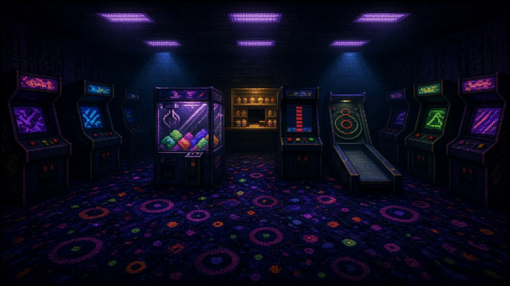
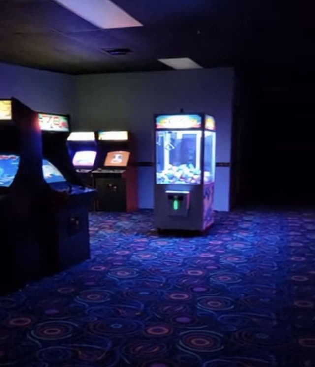
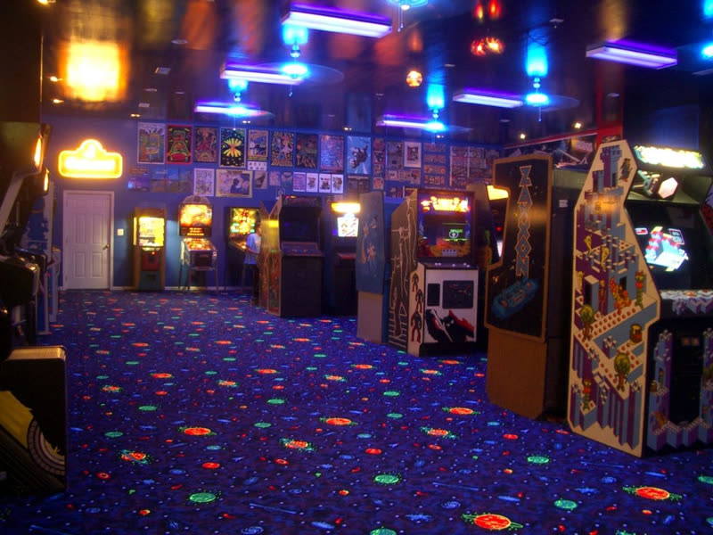

# The Room: dim blacklight arcade, through the PSX look

Set by Jono at T+0:45 (2026-09-26). The Room should read like an empty arcade after closing: low dark ceiling, a few violet fluorescent panels, blue downlight cones, UV carpet glowing on the floor, cabinet screens as the main light. Dimmer than the refs. This sits **on top of** [psx-look.md](./psx-look.md) (low-res canvas, Lambert + snap, fog, dither, CRT overlay); nothing here replaces it.

| Target (concept, generated) | Ref A | Ref B (go darker than this) |
|---|---|---|
|  |  |  |

Rule of the look: **almost nothing is lit, almost everything that reads is emissive.** Lights are for pools, emissives are for shapes. That is also the cheapest way to do it: emissive costs nothing per light.

## 1. Palette additions (Sne owns `palette.ts`)

Keep the existing keys. Add:

```ts
carpet:   '#120d33', // indigo base
uvWall:   '#171436', // walls, barely lighter than void
ceiling:  '#07060f',
cabinet:  '#15131c', // cabinet bodies: near black, screens do the work
neonPink: '#ff3fb4',
neonCyan: '#22e4ff',
neonGreen:'#39ff6a',
neonOrange:'#ff8a1f',
uvPurple: '#b45cff',
tube:     '#d9c8ff', // fluorescent panels
```

Change `void` (background + fog) to `#06051a` so the fade goes indigo-black, not grey-black. Fog `[void, 5, 16]`.

Emissive colours need their own materials, not the Lambert set: `new MeshBasicMaterial({ color })` (unlit, full brightness, still fogged, still dithered). Do **not** psxify basic materials that sit flat on a surface (screens, panels) or they z-fight when snapped; psxify is fine on free-standing emissive shapes.

## 2. Lighting: dim on purpose

```tsx
<hemisphereLight args={['#2a2560', '#05040c', 0.25]} />
{/* one pool per ceiling cone, max 3 */}
<pointLight position={[-3, 3, 0]} color="#3a7bff" intensity={4} distance={5} decay={2} />
<pointLight position={[ 3, 3, 0]} color="#3a7bff" intensity={4} distance={5} decay={2} />
{/* Store counter glow */}
<pointLight position={[0, 2, -4.2]} color="#ffb347" intensity={3} distance={4} decay={2} />
```

- No directional light. The moonlight from psx-look section 3 goes; the ceiling hides it.
- One small coloured `pointLight` inside each playable cabinet at screen height (`intensity 2, distance 2.5`) spills screen colour on the carpet in front. Three Machines, three lights, total under 8: fine for Lambert on a laptop.
- If it is too dark to play, raise the hemisphere to 0.4 before adding lights.

## 3. Blacklight carpet (the signature)

Procedural, 64×64, tiles seamlessly, no asset. Goes in `src/world/look/textures.ts` (psx-look section 6 already reserves that file).

```ts
import * as THREE from 'three'

export function blacklightCarpet(size = 64, seed = 7) {
  const c = document.createElement('canvas')
  c.width = c.height = size
  const g = c.getContext('2d')!
  let s = seed
  const rnd = () => (s = (s * 16807) % 2147483647) / 2147483647
  g.fillStyle = '#120d33'
  g.fillRect(0, 0, size, size)
  for (let i = 0; i < size * size * 0.08; i++) {           // fibre speckle
    g.fillStyle = rnd() < 0.5 ? '#1c1650' : '#0a0820'
    g.fillRect((rnd() * size) | 0, (rnd() * size) | 0, 1, 1)
  }
  const neon = ['#ff3fb4', '#ff8a1f', '#39ff6a', '#22e4ff', '#b45cff']
  for (let i = 0; i < 8; i++) {                            // UV rings + dots
    const x = rnd() * size, y = rnd() * size, r = 2 + rnd() * 5, col = neon[i % neon.length]
    for (const dx of [-size, 0, size]) for (const dy of [-size, 0, size]) {  // draw 9x so edges wrap
      g.strokeStyle = col; g.lineWidth = 1
      g.beginPath(); g.arc(x + dx, y + dy, r, 0, Math.PI * 2); g.stroke()
      g.fillStyle = col; g.fillRect((x + dx) | 0, (y + dy) | 0, 1, 1)
    }
  }
  const t = new THREE.CanvasTexture(c)
  t.magFilter = THREE.NearestFilter
  t.minFilter = THREE.NearestFilter
  t.generateMipmaps = false
  t.wrapS = t.wrapT = THREE.RepeatWrapping
  t.colorSpace = THREE.SRGBColorSpace
  return t
}
```

```tsx
const carpet = useMemo(() => { const t = blacklightCarpet(); t.repeat.set(6, 5); return t }, [])
const carpetMat = useMemo(() => psxify(new THREE.MeshLambertMaterial({
  map: carpet,
  emissive: '#ffffff', emissiveMap: carpet, emissiveIntensity: 0.3, // the UV glow: visible with no light on it
}), true), [carpet])
```

- `emissiveMap` = same texture is what makes it read as UV-reactive in the dark: the rings glow at 0.3 everywhere, and the point lights push them brighter under the cones. Tune `emissiveIntensity` 0.2 to 0.45.
- `CanvasTexture` needs `document`: build it in `useMemo` inside a client component, never at module top level (Next prerender has no DOM).
- The canvas arcs are antialiased; the Nearest filter + dither crunch that away. Do not bother with pixel-perfect circles.

## 4. Ceiling, tubes, light cones

Room shell is 16 wide × 14 deep × 3.2 high around the existing `STATIONS` (x -4..4, Store at z -5). Back wall z = -7.5, side walls x = ±8, camera side open (fog eats it).

```tsx
// ceiling
<mesh position={[0, 3.2, 0]} rotation={[Math.PI / 2, 0, 0]} material={MATERIALS.ceiling}><planeGeometry args={[16, 14]} /></mesh>
// fluorescent panel: unlit box just under the ceiling, 4 to 6 of them
<mesh position={[-3, 3.17, 1]}><boxGeometry args={[1.6, 0.05, 0.45]} /><meshBasicMaterial color="#d9c8ff" /></mesh>
// fake volumetric cone under a downlight (open cone, additive, no depth write)
<mesh position={[-3, 1.6, 0]}>
  <coneGeometry args={[1.1, 3.2, 8, 1, true]} />
  <meshBasicMaterial color="#3a7bff" transparent opacity={0.07} blending={THREE.AdditiveBlending} depthWrite={false} side={THREE.DoubleSide} />
</mesh>
```

The cone is the single biggest "moody arcade" win after the carpet and costs one draw call. The 15-bit dither bands it into stripes, which is exactly the PS1 read.

## 5. Cabinets: dark bodies, glowing faces

Machine devs own their own cabinets; this is the shared idiom so they match, plus filler cabinets for the walls (World slice).

```tsx
function Screen({ w, h, hue }: { w: number; h: number; hue: string }) {
  const tex = useMemo(() => {
    const c = document.createElement('canvas'); c.width = 16; c.height = 12
    const g = c.getContext('2d')!
    g.fillStyle = '#05040c'; g.fillRect(0, 0, 16, 12)
    for (let i = 0; i < 24; i++) { g.fillStyle = Math.random() < 0.5 ? hue : '#ffffff'; g.fillRect((Math.random() * 16) | 0, (Math.random() * 12) | 0, 2, 1) }
    const t = new THREE.CanvasTexture(c)
    t.magFilter = t.minFilter = THREE.NearestFilter; t.generateMipmaps = false
    t.wrapS = t.wrapT = THREE.RepeatWrapping; t.colorSpace = THREE.SRGBColorSpace
    return t
  }, [hue])
  useFrame((_, dt) => { tex.offset.y += dt * 0.15 })   // attract-mode scroll
  return <mesh><planeGeometry args={[w, h]} /><meshBasicMaterial map={tex} /></mesh>
}

export function FillerCabinet({ position, rotationY = 0, hue }: { position: [number, number, number]; rotationY?: number; hue: string }) {
  return (
    <group position={position} rotation={[0, rotationY, 0]}>
      <mesh position={[0, 0.9, 0]} material={MATERIALS.cabinet}><boxGeometry args={[0.8, 1.8, 0.7]} /></mesh>
      <group position={[0, 1.25, 0.36]} rotation={[-0.2, 0, 0]}><Screen w={0.6} h={0.45} hue={hue} /></group>
      <mesh position={[0, 1.72, 0.36]}><boxGeometry args={[0.7, 0.14, 0.02]} /><meshBasicMaterial color={hue} /></mesh> {/* marquee */}
    </group>
  )
}
```

Line 4 to 6 filler cabinets along each side wall facing inward, alternating `neonPink / neonCyan / neonGreen / uvPurple`. No lights in filler cabinets; only the three playable ones get a `pointLight`.

Claw: glass as `meshBasicMaterial transparent opacity 0.08 depthWrite false`, plus one `pointLight` inside the case so the prizes glow (ref A).

## 6. Walls and signage

- Walls: `uvWall` Lambert. Posters: 6 to 10 `planeGeometry` quads 0.5×0.7 on the back and side walls, `meshBasicMaterial` in dim neon colours at ~40% (multiply the hex down, e.g. `#7a1f57`), which reads as blacklight posters.
- Neon sign over the Store: skip text geometry. A `torusGeometry args={[0.35, 0.03, 4, 12]}` or a thin box outline in `meshBasicMaterial neonCyan` reads as neon under the crunch. drei `Text` works, but pass a local `font` file: by default troika fetches a font at runtime, one more network dependency at demo time.

## 7. Optional glow (first to cut)

```tsx
import { Bloom } from '@react-three/postprocessing'
<EffectComposer multisampling={0}>
  <Bloom mipmapBlur luminanceThreshold={0.6} intensity={0.5} />
  <Dither levels={32} />   {/* dither last so the halo is dithered too */}
</EffectComposer>
```

At dpr 0.35 bloom is cheap. It makes screens and tubes bleed like refs A and B. Order matters: Bloom before Dither.

## Cut order for the Room

From the bottom: bloom, posters, filler cabinet screen scroll, filler cabinets, light cones. **Carpet + dark ceiling + emissive tubes are the minimum**; with those three the Room already reads as the refs.

## Sources

- three r186: `MeshLambertMaterial` supports `emissiveMap`, `emissiveIntensity` and fog; `MeshBasicMaterial` is unlit and fogged ([docs](https://threejs.org/docs/#api/en/materials/MeshLambertMaterial)). `CanvasTexture`, `NearestFilter`, `RepeatWrapping` as in psx-look section 6.
- `Bloom` props (`mipmapBlur`, `luminanceThreshold`, `intensity`): [react-postprocessing Bloom](https://react-postprocessing.docs.pmnd.rs/effects/bloom).
- drei `Text` loads its default font at runtime unless `font` is set: [drei Text](https://drei.docs.pmnd.rs/abstractions/text).
- Refs: Jono, arcade channel 2026-09-26. Concept frame generated from them; a mood target, not an asset.
